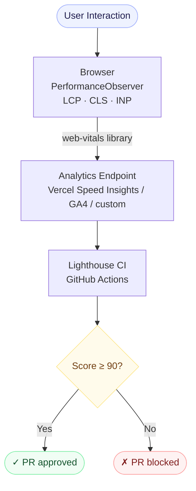

## Why Performance Still Matters

Every 100ms of load time improvement correlates to a measurable increase in conversion. Google's Core Web Vitals are now a ranking signal. Users on slow connections will bounce before your JavaScript finishes parsing.

Performance is not an afterthought — it's an engineering discipline.

## The Core Web Vitals You Need to Own

### LCP — Largest Contentful Paint

LCP measures how long it takes for the largest visible content element to render. Target: **under 2.5s**.

The most common culprits:

- Render-blocking resources (fonts, CSS)
- Unoptimized hero images
- Server response times (TTFB)

**Fix:** Preload your LCP image, use `next/image` with `priority`, and serve fonts with `font-display: swap`.

```tsx
// Correct — next/image with priority for LCP element
import Image from 'next/image';

export function HeroImage() {
  return (
    <Image
      src="/hero.jpg"
      alt="Hero"
      width={1200}
      height={480}
      priority // preloads as LCP candidate
      placeholder="blur" // prevents CLS during load
    />
  );
}
```

### CLS — Cumulative Layout Shift

CLS measures visual stability. Target: **under 0.1**.

The most common culprits:

- Images without explicit `width`/`height`
- Dynamically injected content above the fold
- Web fonts causing FOIT/FOUT

**Fix:** Always declare image dimensions. Reserve space for async content with CSS `min-height`.

### INP — Interaction to Next Paint

INP replaced FID in 2024. It measures responsiveness across all interactions. Target: **under 200ms**.

**Fix:** Defer heavy work off the main thread with `scheduler.postTask`. Avoid long tasks blocking the main thread.

```typescript
// Defer non-critical work off the main thread
async function handleClick() {
  // Critical UI update — immediate
  updateUI();

  // Heavy computation — deferred
  await scheduler.postTask(
    () => {
      computeAnalytics();
    },
    { priority: 'background' },
  );
}
```

## Bundle Analysis in Practice

```bash
# Analyze your Next.js bundle
ANALYZE=true pnpm build
```

Things to look for:

- Duplicated packages (two versions of the same library)
- Libraries imported in full when only one function is used
- Client Components that should be Server Components

## The Design System Tax

A poorly implemented design system adds significant JS overhead. Common mistakes:

- CSS-in-JS (`styled-components`, `Emotion`) — these add a runtime
- Importing full component libraries when only using 3 components
- Hardcoded design tokens instead of CSS custom properties

The right approach: **CSS custom properties + design tokens** — zero runtime, zero JS overhead.

```css
/* ✅ Zero JS runtime — pure CSS custom properties */
:root {
  --color-primary: #6366f1;
  --font-sans: 'Inter', system-ui, sans-serif;
}

/* ❌ Adds ~30 KB runtime — CSS-in-JS */
const Button = styled.button`
  color: ${(p) => p.theme.primary};
`
```

## Performance Measurement Flow

Here is how performance data flows from user interaction to your dashboard:



## Practical Checklist

- [x] RSC-first: default to Server Components
- [x] `next/image` for all images with explicit dimensions
- [x] Font subsetting + `font-display: swap`
- [ ] No render-blocking scripts in `<head>`
- [ ] Bundle analysis on every PR (via `@next/bundle-analyzer`)
- [ ] Lighthouse CI in GitHub Actions

## Conclusion

Performance is the sum of hundreds of small decisions. The platform you build on (Next.js + RSC) does a lot of the heavy lifting — but you still need to make the right calls at every layer of the stack.
