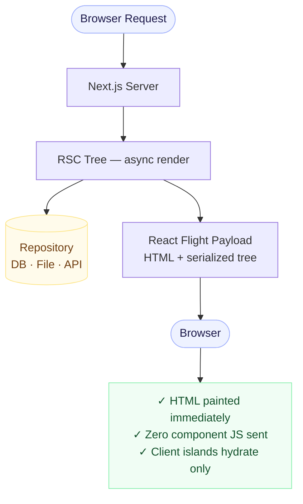

## What Are React Server Components?

React Server Components (RSC) are a new primitive that let you render components **on the server** — and stream their output to the client — without shipping any JavaScript for those components to the browser.

This is fundamentally different from Server-Side Rendering (SSR). With SSR, you render HTML on the server but still hydrate it on the client. With RSC, the component's JavaScript never reaches the client at all.

## Architecture Flow

Here is the complete request lifecycle with React Server Components:



## The Mental Model Shift

Before RSC, the mental model was:

- Fetch data on the server (`getServerSideProps` / `getStaticProps`)
- Pass it as props to the root component
- Hydrate everything on the client

With RSC, you can fetch data **inside any component** in the tree — as long as it's a Server Component — and it never adds to your JS bundle.

```tsx
// This runs only on the server. Zero JS sent to the client.
async function ProjectList() {
  const projects = await projectsRepository.findAll();

  return (
    <ul>
      {projects.map((p) => (
        <li key={p.id}>{p.title}</li>
      ))}
    </ul>
  );
}
```

## When to Use Server vs Client Components

| Scenario                                    | Use              |
| ------------------------------------------- | ---------------- |
| Fetch data from a DB or file system         | Server Component |
| Access backend secrets / env vars           | Server Component |
| Add interactivity (`onClick`, `useState`)   | Client Component |
| Use browser APIs (`localStorage`, `window`) | Client Component |
| Render static or computed UI                | Server Component |

## The Loader Pattern

RSC pages cannot use hooks, so all data orchestration lives in a co-located loader:

```typescript
// app/projects/page.loader.ts
type PageDeps = {
  projectsService: ProjectsService;
};

export type ProjectsPageData = {
  projects: Project[];
};

export async function loadProjectsPage(
  deps: PageDeps = createPageDeps(),
): Promise<ProjectsPageData> {
  const projects = await deps.projectsService.getAll();
  return { projects };
}
```

The page itself stays thin — it only renders:

```tsx
// app/projects/page.tsx
export default async function ProjectsPage() {
  const { projects } = await loadProjectsPage();
  return <ProjectList projects={projects} />;
}
```

## Performance Impact

By defaulting to Server Components, you dramatically reduce the client-side JS payload:

- Project listings: **0 KB** of JS sent to the client
- Article index page: **0 KB** of JS sent to the client
- Only interactive islands (search, theme toggle) ship JavaScript

This is the key to achieving Lighthouse performance scores near 100.

## Gotchas

1. **No hooks in Server Components** — `useState`, `useEffect`, and all React hooks are client-only.
2. **No event handlers** — `onClick` and similar props require a Client Component boundary.
3. **Async by default** — Server Components can be `async` functions; Client Components cannot.

## Conclusion

RSC is not just an optimization — it's a paradigm shift. When you build with an RSC-first mindset, you naturally produce less JavaScript, simpler data flows, and faster pages.
