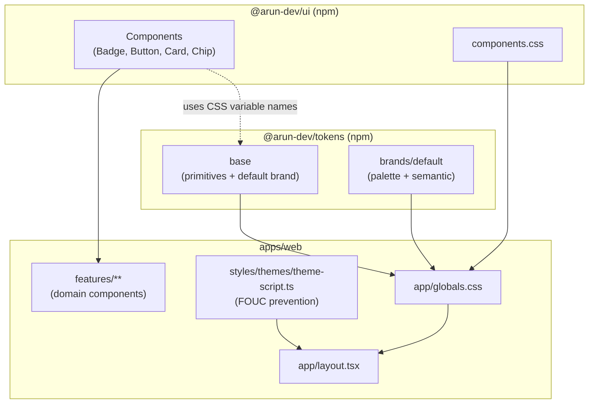
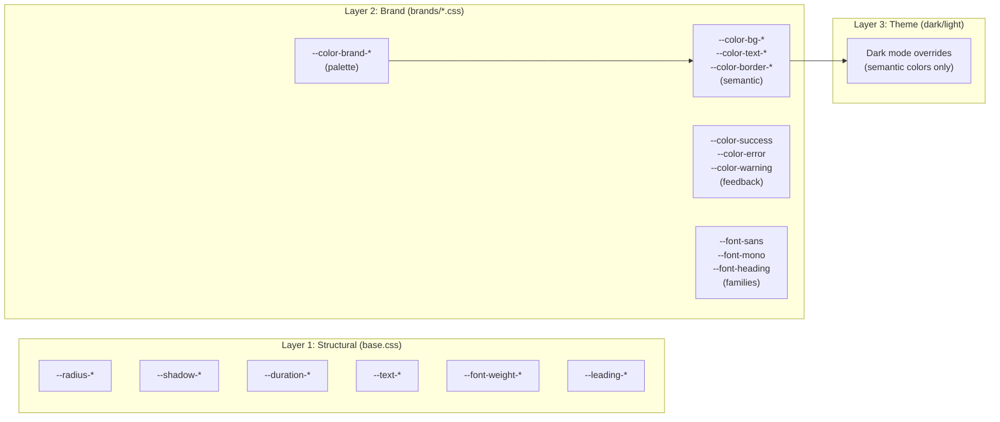
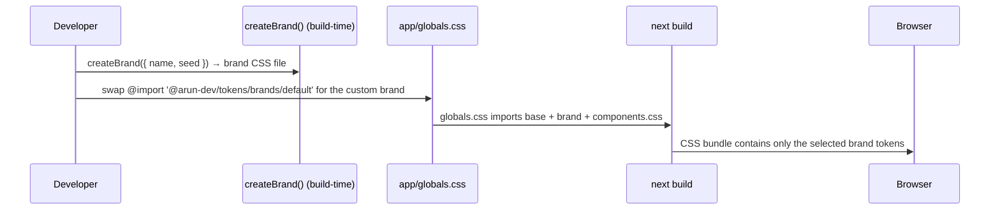
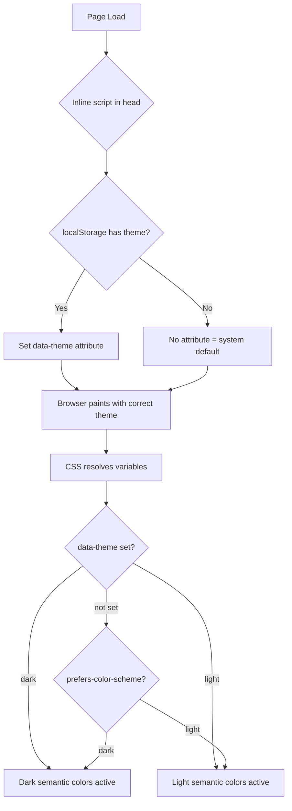
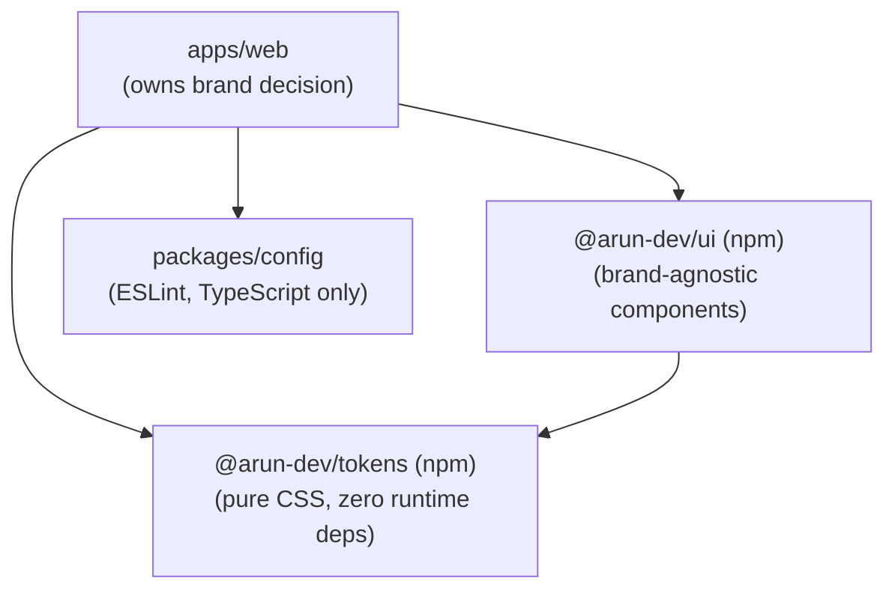
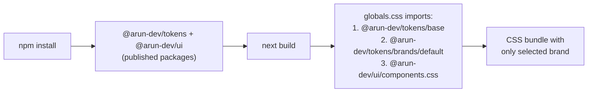

# Design System Architecture — Arun Dev Platform

This document defines the design system foundation, theming strategy, white-labeling architecture, and implementation rules.

It is **strict and enforceable**. Any deviation must be justified and documented.

> **Note:** The design system has been extracted into the standalone
> [arun-design-system](https://github.com/arun9483/arun-design-system) monorepo and is consumed
> here as published npm packages — `@arun-dev/tokens` and `@arun-dev/ui`. Token and component
> source changes happen in that repo; this document describes the architecture and how this
> application consumes it.

---

## 1. Overview

The design system is a **pure CSS** token-based architecture that supports:

- Multiple themes (light, dark, system preference)
- White-label branding (swap brand identity without code changes)
- Performant rendering (zero CSS-in-JS, zero runtime overhead)
- Separation of concerns (tokens, components, and app are independent)

---

## 2. Architecture Diagram



---

## 3. Token Architecture

### 3.1 Token Layers



### 3.2 Token Categories

| Category                 | Location       | White-labelable | Purpose                                                                        |
| ------------------------ | -------------- | :-------------: | ------------------------------------------------------------------------------ |
| Brand colors (10 shades) | `brands/*.css` |       Yes       | Primary palette (`--color-brand-50` to `--color-brand-950`)                    |
| Semantic colors          | `brands/*.css` |       Yes       | Context-mapped (`--color-bg-primary`, `--color-text-primary`)                  |
| Feedback colors          | `brands/*.css` |    Partially    | Status (`--color-success`, `--color-error`, `--color-warning`, `--color-info`) |
| Font families            | `brands/*.css` |       Yes       | Stacks (`--font-sans`, `--font-mono`, `--font-heading`)                        |
| Font sizes               | `base.css`     |       No        | Scale (`--text-xs` to `--text-4xl`)                                            |
| Font weights             | `base.css`     |       No        | Scale (`--font-normal`, `--font-medium`, `--font-bold`)                        |
| Line heights             | `base.css`     |       No        | Leading (`--leading-tight`, `--leading-normal`, `--leading-relaxed`)           |
| Border radius            | `base.css`     |       No        | Corners (`--radius-sm`, `--radius-md`, `--radius-lg`, `--radius-full`)         |
| Shadows                  | `base.css`     |       No        | Elevation (`--shadow-sm`, `--shadow-md`, `--shadow-lg`)                        |
| Transitions              | `base.css`     |       No        | Motion (`--duration-fast`, `--duration-normal`)                                |

---

## 4. White-Labeling Architecture

### 4.1 How It Works



### 4.2 Brand File Contract

Each brand CSS file must define the complete set of brand tokens:

```css
/* Required structure for brands/*.css */

/* 1. Brand palette (10 shades, required) */
:root {
  --color-brand-50: /* lightest */;
  --color-brand-100: ;
  --color-brand-200: ;
  --color-brand-300: ;
  --color-brand-400: ;
  --color-brand-500: /* primary */;
  --color-brand-600: ;
  --color-brand-700: ;
  --color-brand-800: ;
  --color-brand-900: ;
  --color-brand-950: /* darkest */;
}

/* 2. Semantic color mappings (required) */
:root {
  --color-bg-primary: ;
  --color-bg-secondary: ;
  --color-bg-accent: ;
  --color-text-primary: ;
  --color-text-secondary: ;
  --color-text-muted: ;
  --color-border-default: ;
  --color-border-accent: ;
}

/* 3. Feedback colors (required) */
:root {
  --color-success: ;
  --color-error: ;
  --color-warning: ;
  --color-info: ;
}

/* 4. Font families (required) */
:root {
  --font-sans: ;
  --font-mono: ;
  --font-heading: ;
}

/* 5. Dark mode overrides (required) */
@media (prefers-color-scheme: dark) {
  :root:not([data-theme='light']) {
    /* Override semantic colors for dark mode */
  }
}

[data-theme='dark'] {
  /* Explicit dark mode overrides */
}
```

### 4.3 Adding a New Brand

1. Generate the brand stylesheet with `createBrand()` from `@arun-dev/tokens/createBrand` (or hand-write one satisfying the `BrandSemanticContract` type)
2. For a reusable brand, add it under `packages/tokens/src/brands/` in the [arun-design-system](https://github.com/arun9483/arun-design-system) repo and release; for an app-local brand, commit the generated CSS in this repo
3. Swap the brand import in `app/globals.css` (`@arun-dev/tokens/brands/default` → the new brand)
4. No changes needed in `@arun-dev/ui` or application component code

---

## 5. Theme Switching Architecture

### 5.1 Three Theme Modes

| Mode             | How It Works                       | JavaScript Required |
| ---------------- | ---------------------------------- | :-----------------: |
| System (default) | `prefers-color-scheme` media query |         No          |
| Dark (manual)    | `data-theme="dark"` on `<html>`    |    Yes (toggle)     |
| Light (manual)   | `data-theme="light"` on `<html>`   |    Yes (toggle)     |

### 5.2 Theme Resolution Flow



### 5.3 FOUC Prevention

A synchronous inline script runs in `<head>` before any content renders:

```
HTML arrives → inline script reads localStorage → sets data-theme → browser paints (correct theme from first pixel)
```

This script is ~100 bytes, has no dependencies, and executes before React hydration.

---

## 6. Dependency Graph



### 6.1 Dependency Direction Rules

| Package                  | Can Import               | Cannot Import |
| ------------------------ | ------------------------ | ------------- |
| `@arun-dev/tokens` (npm) | Nothing (leaf package)   | `ui`, `web`   |
| `@arun-dev/ui` (npm)     | `tokens`                 | `web`         |
| `apps/web`               | `tokens`, `ui`, `config` | —             |

---

## 7. Package Structure

The token and UI package sources live in the [arun-design-system](https://github.com/arun9483/arun-design-system) monorepo. The structure below is what this application consumes via the published exports.

### 7.1 `@arun-dev/tokens` (npm)

```
@arun-dev/tokens
  /base                     # All primitives + default brand (one import)
  /brands/default           # Default brand (palette + semantic, incl. dark mode)
  /primitives/*             # Individual scales (typography, spacing, radius, shadow, ...)
  /primitives/fonts         # Inter variable font (opt-in @font-face)
  /createBrand              # createBrand(), BrandSemanticContract (compiled, typed)
```

### 7.2 `@arun-dev/ui` (npm)

```
@arun-dev/ui
  .                         # Badge, Button, Card, Chip (compiled ESM/CJS + types)
  /components.css           # All component styles (one import)
  /css/*                    # Individual stylesheets (reset, btn, card, chip, badge, metric, utilities)
```

### 7.3 `apps/web/styles/` (updated)

```
apps/web/
  styles/
    themes/
      theme-script.ts       # Inline script for FOUC prevention
```

---

## 8. Build Pipeline



---

## 9. CSS Variable Resolution Order

```
Structural tokens (base.css: --radius-*, --shadow-*, --space-*)
    ↓ overridden by
Brand tokens (brands/arun.css: --color-*, --font-*)
    ↓ overridden by
Dark mode (@media prefers-color-scheme or [data-theme="dark"])
```

Import order in `globals.css` matters. Later imports override earlier ones for overlapping variables. The correct order is always: `@arun-dev/tokens/base → @arun-dev/tokens/brands/* → @arun-dev/ui/components.css`.

---

## 10. Rules for AI Agents

### DO

- Use CSS custom properties (`var(--token-name)`) for all visual values in components
- Reference semantic tokens (`--color-bg-primary`) over raw brand tokens (`--color-brand-500`) in app code
- Keep UI components brand-agnostic — never reference a specific brand file
- Place structural tokens in `base.css`, brand-specific tokens in `brands/*.css`
- Include dark mode overrides in every brand CSS file
- Follow the brand file contract (Section 4.2) when creating new brands
- Test components with multiple brands to verify token coverage

### DON'T

- Use hardcoded color/font values in components (use `var(--token-name)`)
- Import brand CSS files directly in components — brands are imported only in `globals.css`
- Put brand-specific logic in `@arun-dev/ui` — it must remain brand-agnostic
- Use CSS-in-JS, styled-components, or runtime style generation
- Skip dark mode overrides in brand files
- Reference `@arun-dev/tokens` internal file paths directly in components — use CSS variable names only

---

## 11. Architectural Deviation from CLAUDE.md

**CLAUDE.md** originally stated tokens should live in `apps/web/styles/tokens/`.

**Tokens instead live in the standalone `@arun-dev/tokens` npm package.**

### Justification

- `@arun-dev/ui` components need to consume tokens and cannot depend on `apps/web/` — that violates the dependency direction rule (packages cannot depend on apps)
- Publishing tokens as a standalone npm package enables white-labeling and reuse by any external application
- The design system evolves and versions independently of this application (see the [arun-design-system](https://github.com/arun9483/arun-design-system) repo)

The `apps/web/styles/` directory is retained for:

- `themes/` (app-level theme switching logic)

---

## 12. CSS Modules Architecture

This project uses **CSS Modules** for component-scoped styles with no utility framework.

### Rules

- No utility framework config files — styling is pure CSS
- Component styles live in co-located `*.module.css` files
- All visual values are CSS custom properties (`var(--token-name)`) — no hardcoded values
- Shared layout utilities (`.truncate`, `.sr-only`, `.line-clamp-*`) come from `@arun-dev/ui/css/reset`
- Global typographic scale utilities (`.text-*`, `.leading-*`, `.font-*`) live in `apps/web/app/globals.css`

---
